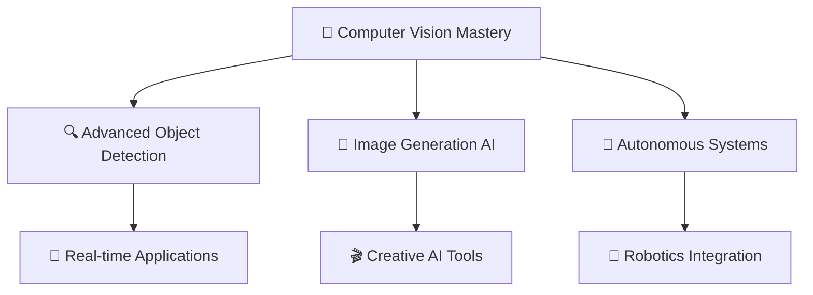

# <div align="center"> WELCOME CODERS </div>

<div align="center">
  
</div>


## <div align="center">⚡ NEURAL PATHWAYS ⚡</div>

```ascii
    ╔═══════════════════════════════════════════════════════════════╗
    ║  🧠 SYSTEM STATUS: ONLINE                                     ║
    ║  🎯 MISSION: Developing AI Autonomous AI Systems, Ethical Hacking, Red Teaming.
    ║  🌟 OBJECTIVE: Building the future, one algorithm at a time   ║
    ║  🚀 STATUS: Continuously evolving                             ║
    ╚═══════════════════════════════════════════════════════════════╝
```

<div align="center">

### 🌌 ABOUT THE ARCHITECT 🌌

```yaml
Name: (WisprDEV) Kenneth Zuill
Role: Budding AI Engineer & Visionary
Focus: Ethical Hacking| Red Teaming | Computer Vision | Machine Learning | Future Tech
Mission: "Transforming imagination into digital reality"
```

</div>

---

## <div align="center">🔮 QUANTUM CAPABILITIES 🔮</div>

<div align="center">
  
</div>

<details>
<summary><b>🧬 Core Technologies&nbsp; </b></summary>

### Programming Languages & Frameworks
```
Python  ████████████████████████████████████████ 95%
C       ████████████████████████████████████████ 90%
JavaScript ████████████████████████████ 55%
```

### AI/ML Arsenal
```
Deep Learning    ████████████████████████████████████████ 95%
Data Science     ████████████████████████████████████████ 92%
Neural Networks  ████████████████████████████████████████ 88%
Computer Vision  █████████████████████████████████████ 68%
```

### Cloud & DevOps
```
AWS         ████████████████████████████████████ 80%
Docker      ████████████████████████████████████ 80%
PostgreSQL  █████████████████████████████████████ 82%
MySQL       ████████████████████████████████████████ 92%
```

</details>

---

## <div align="center">💫 TECH CONSTELLATION 💫</div>

<div align="center">
  
</div>

<div align="center">
  
  
  
  
</div>

---

## <div align="center">📡 NEURAL NETWORK CONNECTIONS 📡</div>


<div align="center">

[](https://linkedin.com/in/Kenneth--agrawal)
[](https://instagram.com/_Kenneth.ag_)
[](https://medium.com/@ds-Kenneth)
[](https://ds-Kenneth.vercel.app/)

</div>

---


## <div align="center"> &nbsp; GitHub Stats &nbsp; </div>

<div align="center">
  
  
</div>

<div align="center">
  
</div>

<div align="center">
  
</div>

---

## <div align="center">🎯 CURRENT MISSIONS 🎯</div>

<div align="center">
  
</div>



---

## <div align="center">💡 WISDOM MATRIX 💡</div>

<div align="center">
  
</div>

---

## <div align="center">🌟 SYSTEM ACHIEVEMENTS 🌟</div>

<div align="center">
  
[](https://github.com/ryo-ma/github-profile-trophy)

</div>

---

<div align="center">
  
</div>

<div align="center">
  
###  TRANSMISSION COMPLETE 


**Engineered with 💜 and ⚡ by [WisprDEV (Kenneth Zuill)]**


</div>

---

<div align="center">
  
</div>
